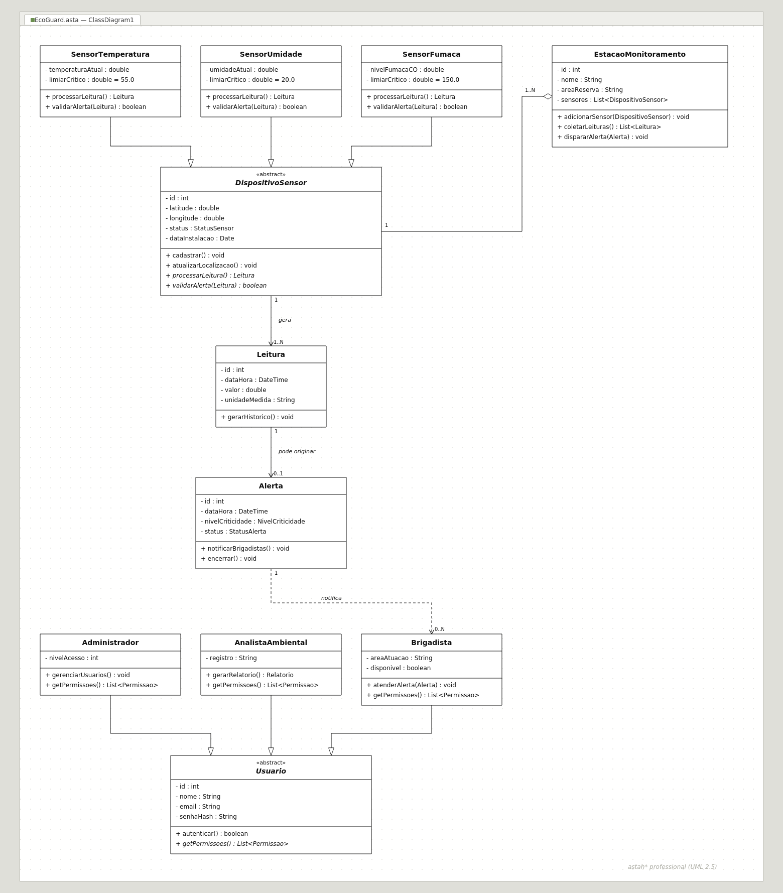
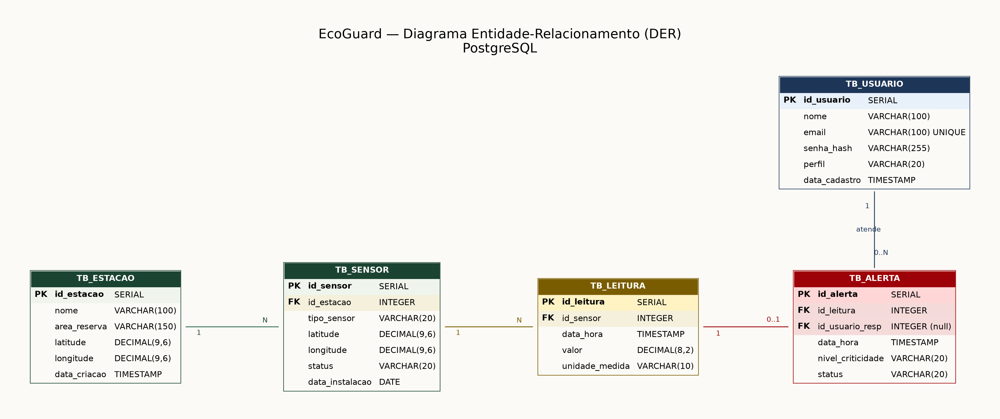

# EcoGuard

Sistema de detecção precoce e prevenção de incêndios florestais com sensores automáticos (IoT), desenvolvido como Avaliação de Estudo Prático (AEP) do 4º semestre de Engenharia de Software.

**ODS vinculada:** ODS 15 — Vida Terrestre (proteção e mitigação de queimadas)

## O problema

Incêndios florestais destroem ecossistemas inteiros, geram perdas econômicas incalculáveis e lançam grandes volumes de carbono na atmosfera. Na maioria dos casos, o que falta não é brigada — é tempo de reação, já que a detecção tardia do fogo é o principal obstáculo enfrentado por quem combate os incêndios.

O EcoGuard propõe uma rede de sensores IoT distribuídos em áreas de risco, monitorando temperatura, umidade e concentração de fumaça em tempo real, e disparando alertas automáticos antes que o fogo se alastre.

## Requisitos funcionais

- **RF01** — Monitoramento em tempo real: coleta e registro contínuo das medições dos sensores (temperatura, umidade relativa do ar e nível de fumaça/monóxido de carbono).
- **RF02** — Emissão de alertas automáticos: notificações de emergência para a central de controle e brigadistas quando as medições ultrapassam os limiares críticos.
- **RF03** — Gestão e geolocalização de sensores: cadastro, atualização e mapeamento geográfico (latitude/longitude) de cada módulo instalado na reserva florestal.
- **RF04** — Gestão de perfis de usuário: autenticação e autorização, com permissões diferenciadas entre Administrador, Analista Ambiental e Brigadista de Campo.
- **RF05** — Relatórios e histórico de ocorrências: leituras históricas consolidadas e registro de incidentes para análises preditivas.

## Stack e justificativa técnica

| Camada | Tecnologia | Por quê |
|---|---|---|
| Linguagem | Java | Fortemente tipada, com suporte completo aos pilares de POO (herança, polimorfismo e encapsulamento) e boa eficiência no processamento concorrente de dados vindos de múltiplos sensores |
| Banco de dados | PostgreSQL | Persistência relacional com integridade referencial via ACID, além de suporte nativo a dados geoespaciais (PostGIS) — essencial para guardar as coordenadas exatas dos sensores |
| Interface | Terminal / Console | Prioriza clareza e rapidez no acesso à informação crítica em campo, com paleta de alto contraste e indicadores visuais de status (Normal, Alerta, Crítico) |

## Diagramas

### Diagrama de Classes (UML)



Estrutura com classe abstrata `DispositivoSensor` (método `processarLeitura()` sobrescrito por `SensorTemperatura`, `SensorUmidade` e `SensorFumaca`), composição 1:N entre `EstacaoMonitoramento` e os sensores, e hierarquia de usuários (`Usuario` → `Administrador`, `AnalistaAmbiental`, `Brigadista`).

### Diagrama Entidade-Relacionamento (DER)



Tabelas principais: `TB_ESTACAO`, `TB_SENSOR`, `TB_LEITURA`, `TB_ALERTA` e `TB_USUARIO`, com chaves primárias e estrangeiras mapeando o relacionamento entre estações, sensores, leituras, alertas e usuários responsáveis pelo atendimento.

## Estrutura do repositório

```
EcoGuard_AEP/
├── docs/
│   ├── Diagrama_Classe_EcoGuard.png
│   ├── DER_EcoGuard.png
│   └── Entrega_Bimestre_1.pdf
├── database/
│   ├── script_banco.sql
│   └── modelagem_der.sql
├── src/
│   ├── controller/
│   ├── model/
│   └── view/
└── README.md
```

## Planejamento — 2º Bimestre

| Prazo | Atividade | Responsável | Status |
|---|---|---|---|
| 15/10/2026 | Modelagem e criação do banco PostgreSQL (DER / scripts) | Lorenzzo Michelim (Banco) | Planejado |
| 25/10/2026 | Implementação do modelo de classes POO e hierarquia de usuários/sensores | Leonardo Gomes (POO) | Planejado |
| 05/11/2026 | Desenvolvimento dos módulos CRUD e persistência via JDBC/ORM | Vinicius Meggiato (Backend) | Planejado |
| 15/11/2026 | Construção das interfaces de usuário (GUI/Terminal) e usabilidade | Lorenzzo Michelim | Planejado |
| 25/11/2026 | Testes de integração, documentação no README e finalização no GitHub | Toda a equipe | Planejado |

## Como rodar

> Seção em atualização conforme o desenvolvimento avança no 2º bimestre.

**Pré-requisitos:** JDK 17+, PostgreSQL 14+ (com extensão PostGIS habilitada).

1. Clone o repositório
   ```
   git clone https://github.com/lorenzzomichelim/EcoGuard_AEP.git
   ```
2. Crie o banco e rode o script em `database/script_banco.sql`
3. Configure as credenciais de conexão no arquivo de configuração da aplicação
4. Compile e execute a partir de `src/`

## Equipe

- **Lorenzzo Michelim** — Banco de dados e interfaces
- **Leonardo Gomes** — Modelagem POO
- **Vinicius Meggiato** — Backend (CRUD e persistência)

## Licença

Projeto acadêmico desenvolvido para a AEP do 4º semestre de Engenharia de Software.
